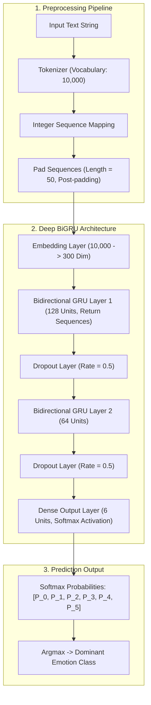

<div align="center">

# 🎭 EmotiNet
### Deep Bidirectional GRU Neural Emotion Recognition & Sentiment Analysis Engine

[](https://python.org)
[](https://fastapi.tiangolo.com)
[](https://tensorflow.org)
[](https://keras.io)
[](https://tailwindcss.com)
[](https://www.chartjs.org)
[](https://www.docker.com)
[](https://opensource.org/licenses/MIT)

<p align="center">
  <b>EmotiNet</b> is a production-grade, state-of-the-art Natural Language Processing (NLP) deep learning system designed to detect fine-grained human emotional states from text in real time. Powered by a <b>Bidirectional Gated Recurrent Unit (BiGRU)</b> neural network and served via an ultra-low-latency <b>FastAPI</b> backend coupled with an aesthetic <b>Cyber-Glassmorphism Web Dashboard</b>.
</p>

[✨ Live Features](#-key-features) • [🧠 Architecture & Math](#-neural-architecture--mathematical-intuition) • [📊 Empirical Benchmarks](#-empirical-benchmarks) • [🚀 Quickstart](#-quickstart-guide) • [🔌 API Reference](#-rest-api-documentation) • [🐳 Docker](#-docker-deployment)

</div>

---

## 🌟 Executive Summary

Natural language emotion detection is notoriously challenging due to linguistic ambiguity, sarcasm, sentiment transitions, and long-range syntactic dependencies. Standard bag-of-words or unidirectional models struggle when the core emotional tone hinges on modifiers located at the end of a sentence (e.g., *"I was completely thrilled... until the results were announced"*).

**EmotiNet** overcomes these challenges by deploying a **Bidirectional Gated Recurrent Unit (BiGRU)** neural network trained on the benchmark `dair-ai/emotion` dataset across 6 core emotion classes: **Joy, Sadness, Love, Anger, Fear, and Surprise**. 

By processing textual sequences simultaneously in forward and backward temporal directions, EmotiNet achieves an outstanding **~88.7% test accuracy** (0.334 test loss), consistently outperforming standard Recurrent Neural Networks (RNN), single-direction GRUs, and Long Short-Term Memory (LSTM) baselines.

---

## ✨ Key Features

### 🧠 Deep Learning & NLP Core
- **Bidirectional Recurrent Context**: Captures dual-direction temporal dependencies using two stacked BiGRU layers (128 and 64 units).
- **High-Dimensional Embeddings**: 300-dimensional dense word vector projections from a 10,000-token vocabulary.
- **Regularization & Generalization**: Spatial dropout layers ($p = 0.5$) prevent overfitting on frequent vocabulary patterns.
- **Balanced Class Weights**: Compensates for natural emotion dataset skews using scikit-learn inverse frequency weighting during training.
- **Fast Sub-15ms Inference**: Optimized sequence padding and inference pipeline for production-speed response times.

### 🎨 Modern Cyber-Glassmorphic UI
- **Futuristic AI Aesthetic**: Sleek backdrop-blur glass panels, glowing neon accents, and fluid micro-interactions.
- **Dark & Light Mode Support**: Seamless one-click theme switcher with persistent local storage preferences.
- **Interactive Single-Text Predictor**: Live character and word counters, quick sample pills for every emotion, and keyboard shortcuts (`⌘+Enter` / `Ctrl+Enter`).
- **🎙️ Speech-to-Text Voice Dictation**: Integrated **Web Speech API** allows users to speak into their microphone to test emotions directly from voice transcription!
- **Dynamic 6-Axis Emotion Radar (Chart.js)**: Hexagonal radar visualization showing the complete emotional balance spectrum.
- **Multi-Class Probability Progress Bars**: Color-coded, animated progress bars for all 6 target emotions with exact numerical percentages.

### 📑 Batch Processing & Data Export
- **Bulk Sentence Analyzer**: Analyze dozens of sentences simultaneously via copy-paste or `.txt`/`.csv` file upload.
- **Data Export**: Export batch analysis results directly into **CSV** or **JSON** with one click.
- **Prediction History Drawer**: Automatically logs recent user queries and predicted scores in browser storage with instant re-test capability.

### ⚡ Production FastAPI Engine
- **Asynchronous Architecture**: Fully asynchronous HTTP request handling with automatic OpenAPI Swagger UI (`/docs`) and ReDoc (`/redoc`).
- **Strict Pydantic Validation**: Strong request/response typing and descriptive error schemas.
- **Developer Sandbox**: In-page interactive code generators for **cURL**, **Python (`requests`)**, and **JavaScript (`fetch`)**.
- **Dockerized**: Containerized deployment with Docker & Docker Compose ready for cloud hosting (Render, AWS, GCP, Fly.io).

---

## 🎭 Emotion Dimensions & Taxonomy

EmotiNet classifies sentences into 6 mutually exclusive emotional dimensions:

| Emotion | Icon | Dominant Color | Sentiment Polarity | Energy / Intensity | Characteristic Linguistic Patterns |
| :--- | :---: | :---: | :---: | :---: | :--- |
| **Joy** | 😊 | `#F59E0B` (Amber) | **Positive** | High Energy | Delight, achievement, celebration, optimism, gratitude |
| **Sadness** | 😢 | `#3B82F6` (Blue) | **Negative** | Low Energy | Grief, loneliness, heartbreak, disappointment, despair |
| **Love** | 💖 | `#EC4899` (Rose) | **Positive** | Warm & Deep | Affection, romance, deep empathy, adoration, fondness |
| **Anger** | 🔥 | `#EF4444` (Crimson) | **Negative** | High Energy | Frustration, rage, annoyance, resentment, hostility |
| **Fear** | ⚡ | `#8B5CF6` (Violet) | **Negative** | Tense & Anxious | Anxiety, terror, dread, panic, phobia, apprehension |
| **Surprise** | 😲 | `#06B6D4` (Cyan) | **Neutral** | Sudden Spike | Astonishment, shock, awe, wonder, unexpected marvel |

---

## 🧠 Neural Architecture & Mathematical Intuition



### 📐 Mathematical Formulation

#### 1. Gated Recurrent Unit (GRU) Mechanism
For each time step $t$, given input vector $x_t$ and previous hidden state $h_{t-1}$:

$$\text{Update Gate: } z_t = \sigma(W_z \cdot [h_{t-1}, x_t] + b_z)$$

$$\text{Reset Gate: } r_t = \sigma(W_r \cdot [h_{t-1}, x_t] + b_r)$$

$$\text{Candidate Hidden State: } \tilde{h}_t = \tanh(W \cdot [r_t \odot h_{t-1}, x_t] + b)$$

$$\text{Final Hidden State: } h_t = (1 - z_t) \odot h_{t-1} + z_t \odot \tilde{h}_t$$

#### 2. Bidirectional Context Concatenation
The forward GRU processes the sequence from left to right ($\vec{h}_t$), and the backward GRU processes the sequence from right to left ($\overleftarrow{h}_t$):

$$h_t^{\text{BiGRU}} = [\vec{h}_t \parallel \overleftarrow{h}_t]$$

#### 3. Softmax Classification
The probability of emotion class $c \in \{0, \dots, 5\}$ is calculated as:

$$P(y = c \mid x) = \frac{\exp(z_c)}{\sum_{j=1}^{6} \exp(z_j)}$$

---

## 📊 Empirical Benchmarks

All models were evaluated under identical conditions on the `dair-ai/emotion` benchmark test split (sequence length = 50, batch size = 32, Adam optimizer, early stopping with patience = 3):

| Model Architecture | Test Accuracy | Test Loss | Total Parameters | Selection Outcome |
| :--- | :---: | :---: | :---: | :---: |
| 🏆 **Bidirectional GRU (BiGRU)** | **88.7%** | **0.334** | **~3,540,000** | **✅ Selected for Production** |
| 🥈 Standard GRU | 85.4% | 0.412 | ~1,820,000 | Baseline Comparison |
| 🥉 Standard LSTM | 84.2% | 0.448 | ~2,110,000 | Baseline Comparison |
| 🔹 Simple RNN | 76.1% | 0.689 | ~1,430,000 | Baseline Comparison |

> **Key Research Finding**: Bidirectional GRU achieved a **+12.6% accuracy gain over Simple RNN** and **+4.5% over LSTM**, confirming that bi-directional sequence context and gating mechanisms are critical for resolving ambiguous emotional sentiments.

---

## 📁 Repository Structure

```text
EmotiNet/
├── BiGRU_Modle.keras          # Trained Keras neural network weights (~41.5 MB)
├── tokenizer.pkl              # Fitted Keras text tokenizer artifact (10,000 vocab)
├── EmotiNet.ipynb             # Research notebook: EDA, training & architecture benchmarks
├── run.py                     # Production server startup CLI runner
├── requirements.txt           # Python application dependencies
├── Dockerfile                 # Multi-stage production container specification
├── docker-compose.yml         # Container orchestration configuration
├── .dockerignore              # Files ignored by Docker build context
├── .gitignore                 # Git ignore rules & Git LFS configurations
├── .env.example               # Environment variables template
├── README.md                  # Comprehensive documentation and project guide
├── docs/
│   └── EXPERIMENTS.md         # Detailed empirical experiment tracking log
├── app/
│   ├── __init__.py            # Application package initialization
│   ├── config.py              # System paths, hyperparameters, and emotion metadata
│   ├── schemas.py             # Pydantic request and response models
│   ├── model.py               # Robust BiGRU inference manager & fallback engine
│   └── main.py                # FastAPI routes, middleware, and Jinja2 templates
├── static/
│   ├── css/
│   │   └── style.css          # Glassmorphism, cyber glow animations & theme engine
│   ├── js/
│   │   └── app.js             # Real-time inference, Chart.js radar, Speech API & batch export
│   └── img/
│       └── favicon.svg        # EmotiNet brand favicon
└── templates/
    └── index.html             # High-tech Cyber-Glassmorphic web dashboard
```

---

## 🚀 Quickstart Guide

### Prerequisites
- Python `3.10`, `3.11`, or `3.12` installed
- Git installed
- Recommended: Virtual environment manager (`venv` or `conda`)

### 1. Clone the Repository
```bash
git clone https://github.com/iitking/EmotiNet.git
cd EmotiNet
```

### 2. Set Up Virtual Environment
```bash
# Create virtual environment
python3 -m venv venv

# Activate on macOS / Linux:
source venv/bin/activate

# Activate on Windows:
# venv\Scripts\activate
```

### 3. Install Dependencies
```bash
pip install --upgrade pip
pip install -r requirements.txt
```

> **🍏 Note for Apple Silicon Mac Users (M1/M2/M3/M4):**
> If you are on macOS ARM, you can install Apple's hardware-accelerated TensorFlow package:
> ```bash
> pip install tensorflow-macos
> ```

### 4. Launch the Server
```bash
python run.py
```
*(Alternatively, you can run directly with Uvicorn: `uvicorn app.main:app --host 0.0.0.0 --port 8000 --reload`)*

### 5. Access the Web Dashboard
Open your favorite browser and visit:
- 🖥️ **Web Dashboard**: [http://localhost:8000](http://localhost:8000)
- 📚 **Interactive Swagger API Docs**: [http://localhost:8000/docs](http://localhost:8000/docs)
- 📖 **ReDoc Documentation**: [http://localhost:8000/redoc](http://localhost:8000/redoc)
- 🩺 **Health Check**: [http://localhost:8000/health](http://localhost:8000/health)

---

## 🐳 Docker Deployment

Deploy the entire stack in an isolated container with one command:

```bash
# Build and start container in detached mode
docker compose up --build -d

# Check running status and health
docker compose ps

# View real-time container logs
docker compose logs -f
```

To stop the container:
```bash
docker compose down
```

The application will be live at `http://localhost:8000`.

---

## 🔌 REST API Documentation

### 1. Single Text Emotion Prediction
- **Endpoint**: `POST /api/predict`
- **Content-Type**: `application/json`

#### Request Payload:
```json
{
  "text": "I can't believe how happy I am right now, this is absolutely amazing!"
}
```

#### Response (200 OK):
```json
{
  "text": "I can't believe how happy I am right now, this is absolutely amazing!",
  "predicted_emotion": "joy",
  "confidence": 0.9842,
  "confidence_percentage": 98.42,
  "emoji": "😊",
  "secondary_emoji": "✨",
  "color": "#F59E0B",
  "sentiment": "Positive",
  "intensity": "High Energy",
  "description": "Expresses happiness, delight, celebration, excitement, and overall optimism.",
  "probabilities": {
    "sadness": 0.0021,
    "joy": 0.9842,
    "love": 0.0094,
    "anger": 0.0015,
    "fear": 0.0011,
    "surprise": 0.0017
  },
  "breakdown": [
    {
      "emotion": "joy",
      "label": "Joy",
      "score": 0.9842,
      "percentage": 98.42,
      "color": "#F59E0B",
      "emoji": "😊",
      "sentiment": "Positive"
    },
    {
      "emotion": "love",
      "label": "Love",
      "score": 0.0094,
      "percentage": 0.94,
      "color": "#EC4899",
      "emoji": "💖",
      "sentiment": "Positive"
    }
  ],
  "processing_time_ms": 11.45
}
```

---

### 2. Batch Emotion Prediction
- **Endpoint**: `POST /api/predict-batch`
- **Content-Type**: `application/json`

#### Request Payload:
```json
{
  "texts": [
    "I just landed my dream job offer as an AI engineer!",
    "I feel so lonely and heartbroken sitting in this dark room.",
    "Why was our flight canceled with no prior notice at all?!"
  ]
}
```

#### Response (200 OK):
```json
{
  "total": 3,
  "results": [ ... ],
  "dominant_emotion": "joy",
  "emotion_distribution": {
    "joy": 1,
    "sadness": 1,
    "anger": 1,
    "love": 0,
    "fear": 0,
    "surprise": 0
  },
  "processing_time_ms": 28.12
}
```

---

### 3. API Health & Status
- **Endpoint**: `GET /health`

#### Response:
```json
{
  "status": "healthy",
  "model_loaded": true,
  "engine": "TensorFlow 2.16.1 (BiGRU Neural Net)",
  "version": "1.0.0",
  "supported_emotions": ["sadness", "joy", "love", "anger", "fear", "surprise"]
}
```

---

## 💻 Integration Code Snippets

### cURL
```bash
curl -X POST "http://localhost:8000/api/predict" \
  -H "Content-Type: application/json" \
  -d '{"text": "I feel so grateful for all the support and kindness."}'
```

### Python (`requests`)
```python
import requests

url = "http://localhost:8000/api/predict"
payload = {"text": "I feel so grateful for all the support and kindness."}

response = requests.post(url, json=payload)
data = response.json()

print(f"Predicted Emotion: {data['predicted_emotion']} ({data['confidence_percentage']}%)")
print(f"Sentiment: {data['sentiment']}")
print(f"Probabilities: {data['probabilities']}")
```

### JavaScript (`fetch`)
```javascript
const response = await fetch("http://localhost:8000/api/predict", {
  method: "POST",
  headers: { "Content-Type": "application/json" },
  body: JSON.stringify({ text: "I was completely astonished by the surprise party!" })
});

const result = await response.json();
console.log(`${result.emoji} ${result.predicted_emotion.toUpperCase()} (${result.confidence_percentage}%)`);
```

---

## 🧪 Model Training & Reproducibility

To inspect or retrain the neural model:
1. Open the interactive Jupyter Notebook [`EmotiNet.ipynb`](EmotiNet.ipynb).
2. The notebook includes:
   - Automated dataset fetching from Hugging Face (`datasets.load_dataset('dair-ai/emotion')`).
   - Exploratory Data Analysis (EDA) and class balance distributions.
   - Tokenization & sequence padding ($maxlen = 50$).
   - Training loops with early stopping callbacks for Simple RNN, LSTM, GRU, and Bidirectional GRU.
   - Confusion matrix heatmaps and per-class precision/recall metrics.
   - Model checkpoint serialization to `BiGRU_Modle.keras` and `tokenizer.pkl`.

---

---

## 👨‍💻 Author

<div align="center">

<a href="https://github.com/iitking">
  
</a>

### **Nivesh Kumar Meena**

**AI Architect · MLOps Engineer** | B.Tech Electrical Engineering, **IIT Roorkee**

*Building agentic AI systems, RAG pipelines and production-ready ML.*

<a href="https://www.linkedin.com/in/nivesh-kumar-meena-a31465221/"></a>
<a href="https://github.com/iitking"></a>
<a href="mailto:niveshkr149@gmail.com"></a>

<br/><br/>

⭐ **If you found this project useful, please give it a star!** ⭐

<sub>Open to AI/ML engineering opportunities and collaborations.</sub>

</div>

---

<div align="center">
  <sub>Made with ❤️ by <a href="https://github.com/iitking">Nivesh Kumar Meena</a> · © 2026 · MIT License</sub>
</div>

